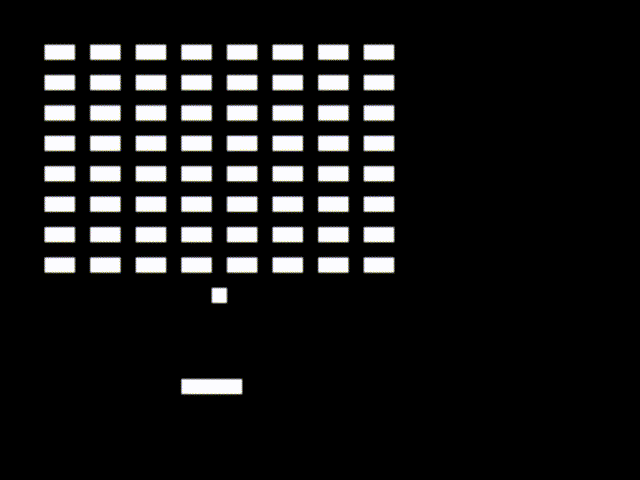

# A breakout-like game that fits in a boot sector (512 bytes)

**boot_breakout** is a breakout-like game that fits in a boot sector (510 bytes + 2 bytes as the boot signature).

[Play it on your browser here.](https://couyoh.github.io/boot_breakout/)



## Build

Requirement: NASM

```shell
make
```

## Run

To run with QEMU:

```shell
make qemu
```

You can use `build/main.bin` as a floppy image in a VM like VirtualBox.

To move, use the <kbd>Left</kbd> or <kbd>Right</kbd> keys.